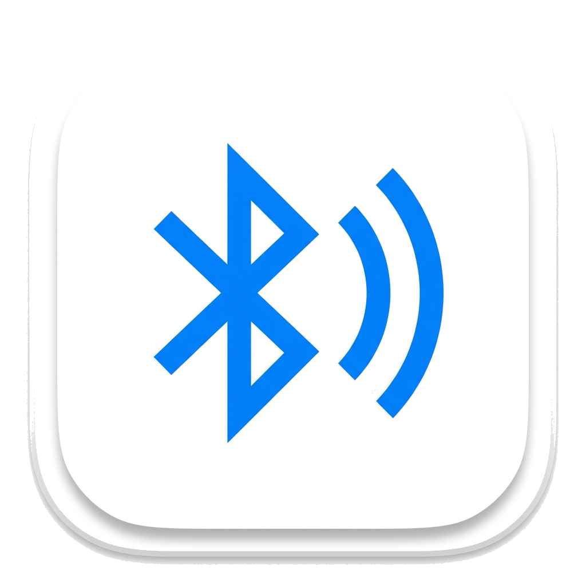

<p align="center">
  
</p>

<h1 align="center">AirAutoLink</h1>

<p align="center">
  <strong>解决 macOS 开机/登录后第三方蓝牙音箱无法自动连接的痛点，精美毛玻璃质感的桌面与菜单栏控制中心。</strong>
</p>

<p align="center">
  <a href="https://developer.apple.com/macos/"></a>
  <a href="https://swift.org"></a>
  <a href="https://github.com/zombieht/air-auto-link/blob/main/LICENSE"></a>
</p>

---

### 💡 为什么需要 AirAutoLink？ (Why AirAutoLink?)

许多第三方蓝牙音响/音箱（例如 Marshall, Bose 等）在 macOS 重新开机、关机重启或重新登录后，系统**不会**像对待 Apple 官方设备（如 AirPods）那样，自动恢复并连接到最近一次使用的音频输出。这导致用户每次开机都必须繁琐地点击系统菜单栏的蓝牙或音频图标，手动触发连接并手动切换音频输出通道。

**AirAutoLink** 就是为了彻底解决这一痛点而生的！在系统启动和音频/蓝牙系统准备就绪后，智能且自动地连接到您最近使用或指定的蓝牙音响，并自动将系统默认音频路由切换过去，为您带来无缝的“开机即用”体验。

---

### ✨ 功能特性

- 🎛️ **毛玻璃控制面板**：提供符合 macOS 现代美学的精致磨砂玻璃窗口，随时直观查看当前蓝牙连接状态与系统音频输出路由。
- 📌 **大头针锁定设备 (Pin)**：支持通过 Pin 列表锁定特定的蓝牙音频设备，确保重连的精准度。未固定时，系统将智能记忆并自动重连最近一次使用的音频设备。
- 🔄 **智能自动重连**：开机登录或系统唤醒后，自动监听蓝牙和音频状态。当检测到系统就绪时，自动尝试建立连接，直到成功。
- 🔊 **自动音频路由**：设备重连成功后，系统支持自动将主声音通道切换至该设备，无需任何手动干预（可配置开关）。
- ⚙️ **极简菜单栏与辅助**：常驻菜单栏，支持随时一键“立即连接”或“停止重试”，并提供一键快捷直达系统“声音”和“蓝牙”偏好设置的便捷入口。
- 🚀 **自启动支持**：开箱即用的“开机自动运行”支持，配置极为简单。

---

### 📥 安装与系统要求

#### 系统要求
* **macOS 15.0 或更高版本**。
* 目标蓝牙音箱/音响需**已事先在 macOS 系统设置中完成首次配对**。

#### 安装方法
* 本项目尚未进行 Apple 公证与 Sandboxing。您可以从 [Releases](https://github.com/zombieht/air-auto-link/releases) 页面下载最新的 `.dmg` 或 `.zip` 压缩包。
* 将 `AirAutoLink.app` 拖入您的 `Applications (应用程序)` 目录即可。

> [!WARNING]
> **由于应用未启用 App Sandbox 及进行 Apple 公证**，首次运行时 macOS Gatekeeper 可能会提示“无法打开”或“无法验证开发者”。
>
> **解决方法**：
> 1. 打开系统的 **系统设置 -> 隐私与安全性**，下滑找到并点击 **“仍要打开”**。
> 2. 或者在终端执行以下命令手动移除隔离属性：
>    ```bash
>    xattr -cr /Applications/AirAutoLink.app
>    ```

---


### 🚀 使用指南

1. **首次配对**：请先在 macOS 系统设置中连接您的蓝牙音箱，确保其处于可正常播放状态。
2. **启动应用**：双击运行 AirAutoLink。应用将常驻在系统菜单栏。
3. **设置设备**：
   - 点击菜单栏的 AirAutoLink 图标，或者双击启动台应用图标唤起精美的主控制面板。
   - 在已配对列表中，找到您的蓝牙音箱，点击右侧的 **📌 大头针 (Pin)** 按钮进行固定。
   - 如果不进行固定，应用在下次启动时也会默认重连 **最近一次使用** 的那个音频设备。
4. **推荐配置**：在控制面板或菜单栏中勾选 **“开机自动运行”** 与 **“连接后自动切换输出”**，获取最佳体验。

---

### 🛠️ 编译、打包与开发

为了保持说明文档的清爽，编译和打包命令已收纳至下方折叠版块中。

<details>
<summary><b>点击展开 / 折叠开发说明</b></summary>

#### 本地运行与开发
直接使用 Xcode 打开 [AirAutoLink.xcodeproj](file:///Users/zombiehuang/Desktop/work/air-auto-link/AirAutoLink.xcodeproj) 并运行 `AirAutoLink` scheme。

#### 命令行构建
* **Debug 编译**：
  ```bash
  xcodebuild -project AirAutoLink.xcodeproj -scheme AirAutoLink -configuration Debug build
  ```
  Debug 版本默认位于 DerivedData 目录，例如：
  `~/Library/Developer/Xcode/DerivedData/AirAutoLink-*/Build/Products/Debug/AirAutoLink.app`

* **Release 编译**：
  ```bash
  xcodebuild -project AirAutoLink.xcodeproj -scheme AirAutoLink -configuration Release build
  ```

#### 一键打包 (DMG / ZIP)
项目提供了一个全自动打包脚本 [package.sh](file:///Users/zombiehuang/Desktop/work/air-auto-link/package.sh)，它会自动编译 Release 版本、执行 Ad-Hoc 本地签名，并生成美化的 DMG 以及 ZIP 文件。

1. 确保安装了 `create-dmg` 工具（脚本在缺失时会尝试使用 Homebrew 自动安装）：
   ```bash
   brew install create-dmg
   ```
2. 运行打包脚本：
   ```bash
   # 使用项目中的默认版本号（来自 Xcode 的 MARKETING_VERSION）进行打包
   ./package.sh

   # 临时指定本次打包的版本号进行打包（不会修改 Xcode 工程配置）
   ./package.sh 1.1.0
   ```
   打包产物会输出到 [build/](file:///Users/zombiehuang/Desktop/work/air-auto-link/build) 目录下。
</details>

---

### ⚠️ 注意事项与 FAQ

> [!IMPORTANT]
> **蓝牙权限申请**
> 首次运行时，应用会请求 macOS 的蓝牙访问权限。如果误拒，请在 **系统设置 -> 隐私与安全性 -> 蓝牙** 中重新勾选允许 AirAutoLink。

> [!NOTE]
> **登录项允许**
> 如果您启用了“开机自动运行”，系统可能会提示有新的登录项被添加。请确保在 **系统设置 -> 通用 -> 登录项与延伸功能** 中允许 AirAutoLink 运行。

> [!TIP]
> **首次配对职责**
> AirAutoLink 专注于解决**已配对**设备的自动重连与音频输出路由切换，它并不负责新蓝牙设备的配对。新设备请先在 macOS 蓝牙设置中进行配对。

---

### 📄 开源许可证

本项目目前用于自用和交流，遵循 **MIT License**。详情请参阅项目中的许可协议。
